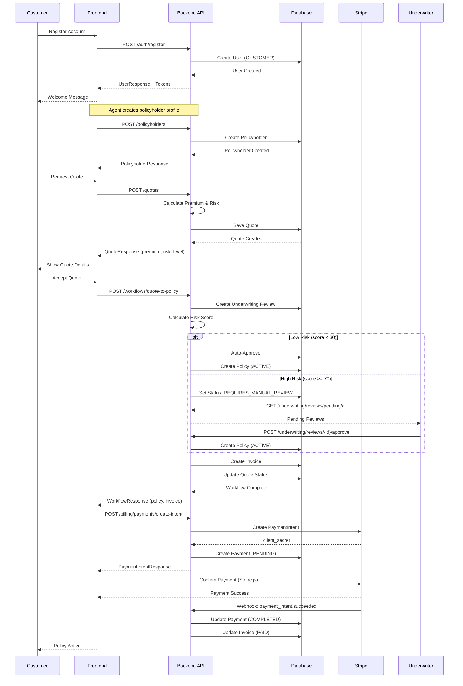
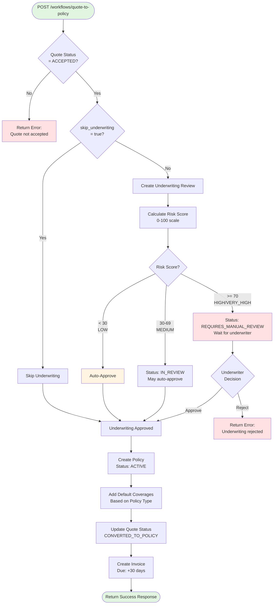
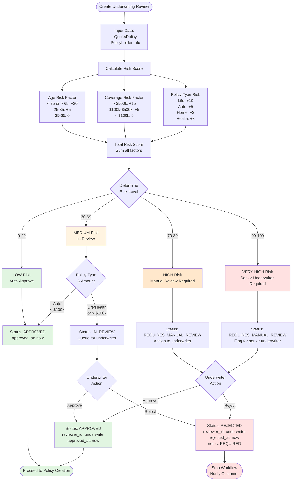
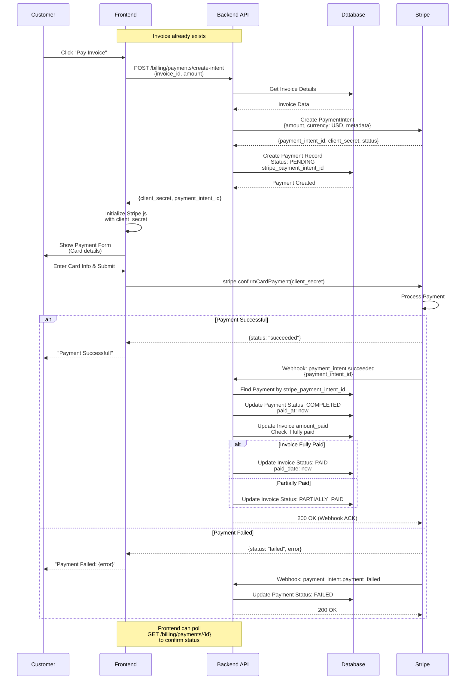
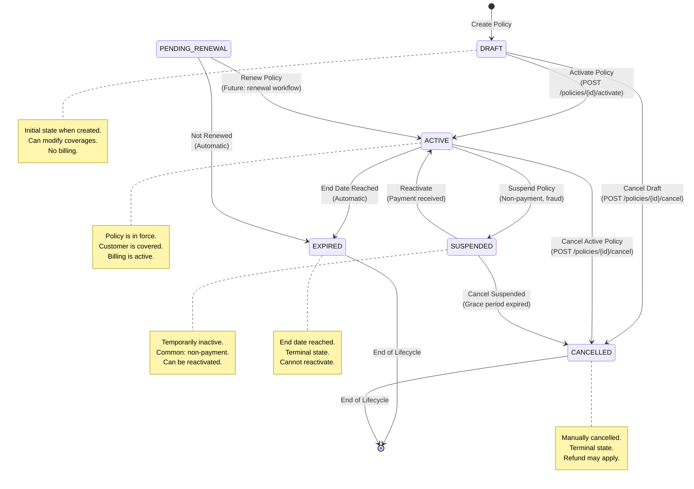
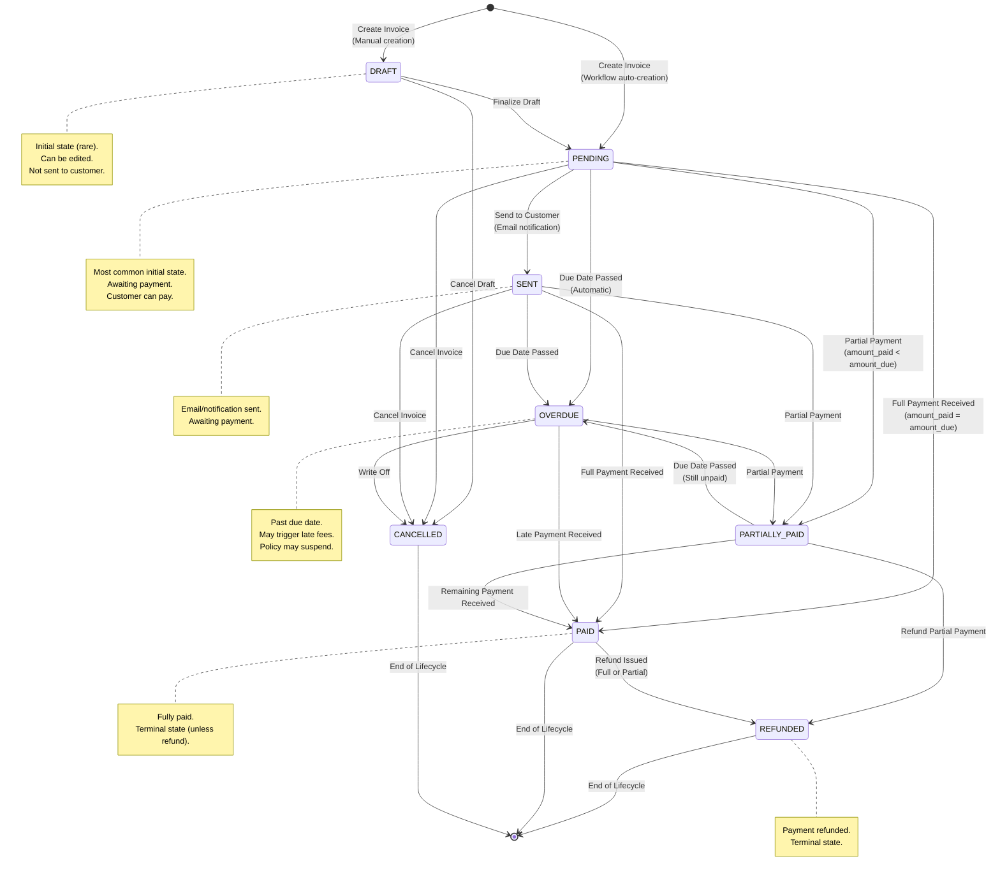

# Insurance Core - Workflow Diagrams

Visual representations of key workflows and processes in the Insurance Core system.

---

## Table of Contents

1. [Complete Customer Journey](#1-complete-customer-journey)
2. [Quote-to-Policy Workflow](#2-quote-to-policy-workflow)
3. [Underwriting Decision Process](#3-underwriting-decision-process)
4. [Payment Processing Flow](#4-payment-processing-flow)
5. [Policy Status State Machine](#5-policy-status-state-machine)
6. [Authentication Flow](#6-authentication-flow)
7. [Role-Based Access Control](#7-role-based-access-control)
8. [Invoice Lifecycle](#8-invoice-lifecycle)

---

## 1. Complete Customer Journey

**Description:** End-to-end flow from user registration to active policy with payment.



**Key Steps:**
1. **Registration** - Customer creates account (CUSTOMER role)
2. **Policyholder Creation** - Agent creates policyholder profile with personal details
3. **Quote Request** - Customer requests insurance quote, system calculates premium and risk
4. **Quote Acceptance** - Customer accepts quote, triggers workflow
5. **Underwriting Review** - Automated risk assessment with optional manual review
6. **Policy Creation** - Policy created with ACTIVE status upon approval
7. **Invoice Generation** - Invoice created automatically with 30-day due date
8. **Payment Processing** - Customer pays via Stripe, webhook confirms payment
9. **Active Policy** - Customer is now covered

---

## 2. Quote-to-Policy Workflow

**Description:** Detailed workflow for converting an accepted quote into an active policy.



**Workflow Steps:**

1. **Validate Quote** - Must be in ACCEPTED status
2. **Check Underwriting Skip** - Can skip for low-risk scenarios
3. **Create Underwriting Review** - If not skipped
4. **Calculate Risk Score** - 0-100 based on age, coverage, policy type
5. **Risk-Based Decision**:
   - LOW (< 30): Auto-approve immediately
   - MEDIUM (30-69): May auto-approve or require review
   - HIGH/VERY_HIGH (>= 70): Requires manual underwriter approval
6. **Create Policy** - Only if approved, status = ACTIVE
7. **Add Coverages** - Default coverages based on policy type
8. **Update Quote** - Status = CONVERTED_TO_POLICY
9. **Create Invoice** - Due date = 30 days from now
10. **Return Response** - Comprehensive workflow result

**Response Includes:**
- Quote details and new status
- Underwriting review ID and decision
- Risk score and level
- Policy ID and number
- Invoice ID and amount
- Workflow timing metrics

---

## 3. Underwriting Decision Process

**Description:** How risk assessment and underwriting decisions are made.



**Risk Score Calculation:**

| Factor | Condition | Points |
|--------|-----------|--------|
| **Age** | < 25 years old | +20 |
| | 25-35 years old | +5 |
| | 35-65 years old | 0 |
| | > 65 years old | +20 |
| **Coverage Amount** | > $500,000 | +15 |
| | $100,000 - $500,000 | +5 |
| | < $100,000 | 0 |
| **Policy Type** | Life Insurance | +10 |
| | Health Insurance | +8 |
| | Auto Insurance | +5 |
| | Home Insurance | +3 |

**Risk Levels:**

- **LOW (0-29)**: Auto-approve immediately
- **MEDIUM (30-69)**: May require review based on policy type
- **HIGH (70-89)**: Always requires manual review
- **VERY HIGH (90-100)**: Requires senior underwriter approval

---

## 4. Payment Processing Flow

**Description:** Stripe payment integration from invoice to payment confirmation.



**Payment Flow Steps:**

1. **Create PaymentIntent**
   - Backend creates Stripe PaymentIntent
   - Backend creates Payment record (status: PENDING)
   - Returns `client_secret` to frontend

2. **Frontend Confirmation**
   - Initialize Stripe.js with `client_secret`
   - Customer enters payment details
   - Call `stripe.confirmCardPayment()`

3. **Stripe Processing**
   - Stripe processes the payment
   - Returns success/failure to frontend immediately

4. **Webhook Update** (Asynchronous)
   - Stripe sends webhook to backend
   - Backend updates Payment status (COMPLETED/FAILED)
   - Backend updates Invoice amount_paid
   - If fully paid, Invoice status → PAID

5. **Confirmation**
   - Frontend shows success/failure message
   - Can poll payment status for confirmation

**Key Points:**
- Payment status updates are asynchronous (webhook-driven)
- Frontend receives immediate feedback from Stripe
- Backend updates happen via webhook (reliable, secure)
- Invoice automatically marked PAID when fully paid
- Supports partial payments (Phase 6)

---

## 5. Policy Status State Machine

**Description:** Valid policy statuses and allowed transitions.



**Status Descriptions:**

| Status | Description | Can Modify? | Billing Active? |
|--------|-------------|-------------|-----------------|
| **DRAFT** | Newly created, not yet active | ✅ Yes | ❌ No |
| **PENDING_APPROVAL** | Awaiting underwriting approval | ❌ No | ❌ No |
| **ACTIVE** | Policy in force, customer covered | ❌ No | ✅ Yes |
| **SUSPENDED** | Temporarily inactive (e.g., non-payment) | ❌ No | ⚠️ Paused |
| **EXPIRED** | End date reached, coverage ended | ❌ No | ❌ No |
| **CANCELLED** | Manually cancelled before expiration | ❌ No | ❌ No |
| **PENDING_RENEWAL** | Approaching end date, renewal available | ❌ No | ✅ Yes |

**Allowed Transitions:**

| From | To | Trigger | Role Required |
|------|----|---------|--------------| 
| DRAFT | ACTIVE | Manual activation | AGENT+ |
| DRAFT | CANCELLED | Manual cancellation | AGENT+ |
| ACTIVE | SUSPENDED | Non-payment detected | SYSTEM/AGENT+ |
| ACTIVE | EXPIRED | End date reached | SYSTEM (automatic) |
| ACTIVE | CANCELLED | Manual cancellation | AGENT+ |
| SUSPENDED | ACTIVE | Payment received | SYSTEM/AGENT+ |
| SUSPENDED | CANCELLED | Grace period expired | AGENT+ |
| PENDING_RENEWAL | ACTIVE | Renewal completed | AGENT+ |
| PENDING_RENEWAL | EXPIRED | Not renewed | SYSTEM (automatic) |

**Business Rules:**
- Only DRAFT policies can have coverages added/removed
- ACTIVE policies generate invoices
- EXPIRED and CANCELLED are terminal states (no further transitions)
- Automatic transitions happen via scheduled jobs (not implemented in Phase 8)

---

## 6. Authentication Flow

**Description:** User authentication, token management, and session lifecycle.

```mermaid
sequenceDiagram
    participant U as User
    participant F as Frontend
    participant API as Backend API
    participant DB as Database

    %% Registration
    rect rgb(230, 245, 230)
        note right of U: Registration Flow
        U->>F: Register (email, password, full_name)
        F->>API: POST /auth/register
        API->>API: Validate email format<br/>Check password strength
        API->>DB: Check email uniqueness
        
        alt Email Exists
            DB-->>API: Email found
            API-->>F: 400 Error: Email exists
            F-->>U: "Email already registered"
        else Email Available
            DB-->>API: Email available
            API->>API: Hash password (bcrypt)
            API->>DB: Create User (role: CUSTOMER)
            DB-->>API: User created
            API->>API: Generate JWT tokens<br/>access (30min)<br/>refresh (7 days)
            API-->>F: {user, access_token, refresh_token}
            F->>F: Store tokens<br/>(localStorage/cookie)
            F-->>U: "Welcome! Registration successful"
        end
    end

    %% Login
    rect rgb(230, 235, 245)
        note right of U: Login Flow
        U->>F: Login (email, password)
        F->>API: POST /auth/login
        API->>DB: Find user by email
        
        alt User Not Found
            DB-->>API: No user
            API-->>F: 401 Error: Invalid credentials
            F-->>U: "Invalid email or password"
        else User Found
            DB-->>API: User data
            API->>API: Verify password hash
            
            alt Password Invalid
                API-->>F: 401 Error: Invalid credentials
                F-->>U: "Invalid email or password"
            else Password Valid
                alt User Inactive
                    API-->>F: 403 Error: Account disabled
                    F-->>U: "Account is disabled"
                else User Active
                    API->>API: Generate JWT tokens
                    API-->>F: {access_token, refresh_token}
                    F->>F: Store tokens
                    F-->>U: "Login successful"
                end
            end
        end
    end

    %% Authenticated Request
    rect rgb(245, 240, 230)
        note right of U: Making Authenticated Request
        U->>F: Access Protected Resource
        F->>API: GET /policies<br/>Authorization: Bearer {access_token}
        API->>API: Verify JWT signature<br/>Check expiration<br/>Extract user_id & role
        
        alt Token Expired
            API-->>F: 401 Error: Token expired
            F->>F: Attempt token refresh
            F->>API: POST /auth/refresh<br/>{refresh_token}
            
            alt Refresh Valid
                API->>API: Verify refresh token
                API->>API: Generate new access token
                API-->>F: {access_token}
                F->>F: Store new access token
                F->>API: Retry: GET /policies<br/>New access token
                API->>DB: Fetch policies
                DB-->>API: Policy data
                API-->>F: Policy list
                F-->>U: Show policies
            else Refresh Invalid/Expired
                API-->>F: 401 Error: Refresh token invalid
                F->>F: Clear all tokens
                F-->>U: Redirect to login
            end
            
        else Token Valid
            API->>DB: Fetch policies<br/>(filtered by role & ownership)
            DB-->>API: Policy data
            API-->>F: Policy list
            F-->>U: Show policies
        end
    end

    %% Logout
    rect rgb(245, 230, 230)
        note right of U: Logout Flow
        U->>F: Logout
        F->>F: Clear tokens from storage
        F->>API: POST /auth/logout (optional)
        API-->>F: 204 No Content
        F-->>U: Redirect to login page
    end
```



**Token Details:**

| Token Type | Lifetime | Storage | Use |
|------------|----------|---------|-----|
| **Access Token** | 30 minutes | localStorage or memory | API authentication |
| **Refresh Token** | 7 days | httpOnly cookie (recommended) | Token refresh |

**Token Payload (JWT):**
```json
{
  "sub": "user-uuid",
  "email": "user@example.com",
  "role": "CUSTOMER",
  "is_superuser": false,
  "exp": 1735689600,
  "iat": 1735688000
}
```

**Security Best Practices:**
1. Store access token in memory or localStorage
2. Store refresh token in httpOnly cookie (prevents XSS)
3. Always use HTTPS in production
4. Implement token refresh before expiration (e.g., at 25 minutes)
5. Clear all tokens on logout
6. Never log tokens
7. Implement rate limiting on auth endpoints

---

## 7. Role-Based Access Control

**Description:** Permission checking and ownership validation logic.

```mermaid
flowchart TD
    Start([API Request]) --> HasToken{Authorization<br/>Header?}
    
    HasToken -->|No| Public{Endpoint<br/>Public?}
    Public -->|Yes| AllowPublic[Allow Access]
    Public -->|No| Deny401[401 Unauthorized<br/>"Missing token"]
    
    HasToken -->|Yes| VerifyToken[Verify JWT Token]
    VerifyToken --> TokenValid{Token Valid?}
    
    TokenValid -->|No| Deny401B[401 Unauthorized<br/>"Invalid token"]
    TokenValid -->|Yes| ExtractUser[Extract user_id & role]
    
    ExtractUser --> CheckActive{User<br/>is_active?}
    CheckActive -->|No| Deny403A[403 Forbidden<br/>"Account disabled"]
    CheckActive -->|Yes| CheckSuper{is_superuser?}
    
    CheckSuper -->|Yes| AllowSuper[✅ Allow All<br/>Bypass role checks]
    CheckSuper -->|No| CheckRole{Endpoint<br/>Role Requirement}
    
    CheckRole -->|None Required| AllowAuth[Allow Access]
    CheckRole -->|ADMIN| IsAdmin{User role<br/>= ADMIN?}
    CheckRole -->|UNDERWRITER+| IsUnderwriter{User role in<br/>[UNDERWRITER, ADMIN]?}
    CheckRole -->|AGENT+| IsAgent{User role in<br/>[AGENT, UNDERWRITER, ADMIN]?}
    
    IsAdmin -->|No| Deny403B[403 Forbidden<br/>"Admin role required"]
    IsAdmin -->|Yes| AllowRole[Allow Access]
    
    IsUnderwriter -->|No| Deny403C[403 Forbidden<br/>"Underwriter role required"]
    IsUnderwriter -->|Yes| AllowRole
    
    IsAgent -->|No| Deny403D[403 Forbidden<br/>"Agent role required"]
    IsAgent -->|Yes| AllowRole
    
    AllowAuth --> CheckOwnership{Ownership<br/>Validation?}
    AllowRole --> CheckOwnership
    
    CheckOwnership -->|Not Required| Execute[Execute Endpoint]
    CheckOwnership -->|Required| IsCustomer{User role<br/>= CUSTOMER?}
    
    IsCustomer -->|No| Execute
    IsCustomer -->|Yes| OwnsResource{User owns<br/>resource?}
    
    OwnsResource -->|No| Deny403E[403 Forbidden<br/>"Access denied"]
    OwnsResource -->|Yes| Execute
    
    Execute --> Success([200/201 Response])
    
    style AllowPublic fill:#e1f5e1
    style AllowSuper fill:#e1f5e1
    style AllowAuth fill:#e1f5e1
    style AllowRole fill:#e1f5e1
    style Execute fill:#e1f5e1
    style Success fill:#e1f5e1
    style Deny401 fill:#ffe1e1
    style Deny401B fill:#ffe1e1
    style Deny403A fill:#ffe1e1
    style Deny403B fill:#ffe1e1
    style Deny403C fill:#ffe1e1
    style Deny403D fill:#ffe1e1
    style Deny403E fill:#ffe1e1
```

**Role Hierarchy:**

```
ADMIN (Highest)
  ↓
UNDERWRITER
  ↓
AGENT
  ↓
CUSTOMER (Lowest)
```

**Permission Matrix:**

| Endpoint | CUSTOMER | AGENT | UNDERWRITER | ADMIN |
|----------|----------|-------|-------------|-------|
| POST /auth/register | ✅ Public | ✅ Public | ✅ Public | ✅ Public |
| GET /policyholders/{id} | ✅ Own only | ✅ All | ✅ All | ✅ All |
| POST /policyholders | ❌ | ✅ | ✅ | ✅ |
| POST /quotes | ✅ Own | ✅ All | ✅ All | ✅ All |
| POST /quotes/{id}/accept | ✅ Own | ✅ All | ✅ All | ✅ All |
| POST /policies | ❌ | ✅ | ✅ | ✅ |
| POST /underwriting/reviews | ❌ | ❌ | ✅ | ✅ |
| POST /billing/invoices | ❌ | ✅ | ✅ | ✅ |
| POST /pricing-rules | ❌ | ❌ | ❌ | ✅ |
| POST /users/{id}/role | ❌ | ❌ | ❌ | ✅ |

**Ownership Validation:**

For CUSTOMER role, access is restricted to:
- Policyholders where `user_id = current_user.id`
- Policies owned by their policyholders
- Quotes owned by their policyholders
- Invoices for their policies
- Payments for their invoices

**Superuser:**
- Bypasses ALL role and ownership checks
- Full access to all resources
- Typically system admin accounts

---

## 8. Invoice Lifecycle

**Description:** Invoice status transitions from creation to payment/cancellation.



**Status Descriptions:**

| Status | Description | amount_paid | amount_remaining |
|--------|-------------|-------------|------------------|
| **DRAFT** | Not finalized, editable | 0 | amount_due |
| **PENDING** | Awaiting payment | 0 | amount_due |
| **SENT** | Notification sent to customer | 0 | amount_due |
| **PAID** | Fully paid | amount_due | 0 |
| **OVERDUE** | Past due date, unpaid | 0 or partial | > 0 |
| **PARTIALLY_PAID** | Some payment received | > 0 | > 0 |
| **CANCELLED** | Invoice cancelled | any | any |
| **REFUNDED** | Payment refunded | varies | varies |

**Automatic Transitions:**

| Trigger | From | To | Timing |
|---------|------|----|--------|
| Payment completed | PENDING/SENT/OVERDUE | PAID | Immediate (webhook) |
| Partial payment | PENDING/SENT/OVERDUE | PARTIALLY_PAID | Immediate (webhook) |
| Due date passed | PENDING/SENT | OVERDUE | Daily job (midnight) |
| Refund issued | PAID | REFUNDED | Immediate (API call) |

**Business Rules:**

1. **Payment Processing:**
   - Each successful payment updates `amount_paid`
   - If `amount_paid >= amount_due`, status → PAID
   - If `0 < amount_paid < amount_due`, status → PARTIALLY_PAID

2. **Overdue Detection:**
   - Runs daily at midnight
   - Checks all invoices with `due_date < today` and status in [PENDING, SENT]
   - Updates status to OVERDUE

3. **Refunds:**
   - Only PAID invoices can be refunded
   - Full refund: `amount_paid = 0`, status → REFUNDED
   - Partial refund: `amount_paid -= refund_amount`, status → PARTIALLY_PAID

4. **Cancellation:**
   - Can cancel DRAFT, PENDING, SENT, OVERDUE, PARTIALLY_PAID
   - Cannot cancel PAID or REFUNDED (use refund instead)

---

## Summary

These diagrams represent the core workflows in the Insurance Core system:

1. **Customer Journey** - Complete end-to-end flow
2. **Quote-to-Policy** - Automated conversion workflow
3. **Underwriting** - Risk assessment and approval process
4. **Payment** - Stripe integration flow
5. **Policy Status** - Policy lifecycle state machine
6. **Authentication** - User auth and token management
7. **RBAC** - Role-based access control logic
8. **Invoice Lifecycle** - Invoice status transitions

All diagrams use Mermaid.js syntax and can be rendered in:
- GitHub markdown preview
- VS Code with Mermaid extension
- GitLab, Notion, Obsidian
- Online: mermaid.live

For more details on API endpoints and request/response formats, see the main API User Guide.
